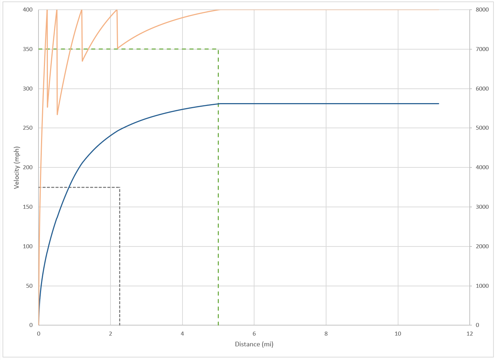

# V_MAX

A project borne out of sheer curiosity: can a given vehicle with an engine crack 240 mph over a 5-mile run on the salt flats?

What unfolded was an epic saga replete with ordinary differential equations, Taylor series and gear ratio optimization... all in a single Excel spreadsheet.

## Future Work

This thing has potential to be implemented as a 0D-vehicle dynamics simulator for drag racing. Web service, dockerize, season to taste.

